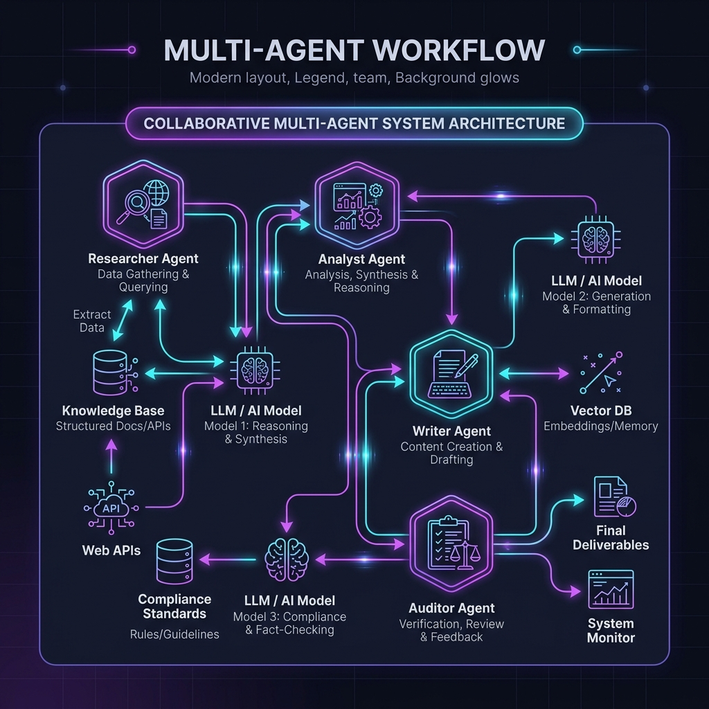
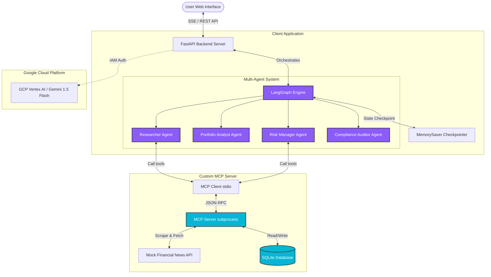

# 🛡️ Aegis Risk: Multi-Agent Financial Portfolio Risk Analyzer



A real-world production-grade AI portfolio project demonstrating **Agentic AI**, **Model Context Protocol (MCP)**, **LangGraph orchestration**, **State Management**, and **GCP Cloud Run deployment with Vertex AI**.

This project simulates a financial advisory system where multiple specialized AI agents collaborate to analyze market news, calculate portfolio exposure, assess compliance risks, and generate detailed assessment reports stored in a local database.

---

## 🏗️ Architecture Overview

The system utilizes a client-server architecture separating the **Model Orchestration Client** (LangGraph) from the **Data & Tools Server** (MCP Protocol) to achieve secure, modular data integration.



### 🤝 The Multi-Agent Loop
1. **Market News Researcher**: Discovers if the stock is currently held in the user's holdings and pulls the latest headlines using custom MCP tools.
2. **Portfolio Analyst**: Correlates news catalysts with the current portfolio exposure (shares, average cost basis) and performs quantitative calculations.
3. **Risk Manager**: Drafts a detailed Markdown report and classifies risk (Low, Medium, High). Invokes the database tool to save the assessment.
4. **Compliance Auditor**: Reviews the drafted report. If compliance rules are met, it approves the report. If not, it issues feedback and routes back to the Risk Manager for revision.

---

## 🛠️ Tech Stack & Key Concepts

- **LangGraph**: Orchestrates the multi-agent execution DAG with a defined state schema, custom routing edges, and checking loops.
- **Model Context Protocol (MCP)**: Establishes a standard protocol connection via `stdio` to run a localized database and scraping toolkit.
- **FastAPI**: Manages lifespan connections for the MCP subprocess and serves Server-Sent Events (SSE) to deliver real-time agent console logs to the UI.
- **Tailored UI Aesthetics**: Premium glassmorphic design utilizing rich dark palettes, dynamic SVG indicators, pulsing loaders, and a live pipeline visualizer.
- **GCP Vertex AI**: Connects to the Gemini models natively via GCP Service Accounts (IAM roles) avoiding manual API key management in production.

---

## 🚀 Local Quickstart

### Prerequisites
- Python 3.12+
- Git
- An API Key (Google Gemini API key) OR authenticated Google Cloud SDK.

### 1. Clone & Set Up Environment
```bash
# Clone the repository
git clone <your-repo-url>
cd multiagent-mcp-gcp-portfolio

# Create virtual environment
python -m venv .venv
source .venv/bin/activate  # On Windows: .venv\Scripts\activate

# Install dependencies
pip install -r requirements.txt
```

### 2. Configure Environment Variables
Create a `.env` file in the project root:
```env
# For local testing fallback (Standard Gemini API)
GOOGLE_API_KEY=your_gemini_api_key_here

# For GCP Vertex AI (set to false for local testing with API key)
USE_VERTEX_AI=false
```

### 3. Run Verification Tests
Before starting the web server, run the automated integration test to verify the LangGraph-MCP connection:
```bash
python test_agents.py
```
This script will launch the MCP server in a background subprocess, run the agentic workflow, save a report to the SQLite DB, and verify the database entry.

### 4. Start the Web App
```bash
python app.py
```
Open your browser and navigate to `http://localhost:8000`.

---

## ☁️ GCP Deployment (Cloud Run + Vertex AI)

The production architecture deploys the container to **Google Cloud Run**, which calls **Gemini via Vertex AI**. Authentication is managed entirely through GCP Service Accounts.

### Prerequisites
1. Installed and authenticated [Google Cloud SDK](https://cloud.google.com/sdk/docs/install) (`gcloud auth login`).
2. A GCP project with billing enabled.

### Automated Deployment
We provide an automated bash script to configure permissions and deploy:
```bash
chmod +x deploy.sh
./deploy.sh
```

### What this script does under the hood:
1. Enables GCP APIs: Cloud Run, Artifact Registry, Vertex AI, Cloud Build.
2. Creates a Service Account (`agentic-portfolio-sa`).
3. Binds the `roles/aiplatform.user` (Vertex AI User) role to the Service Account, granting permission to call Gemini.
4. Builds the Docker image locally and pushes it to Google Artifact Registry.
5. Deploys the service to **GCP Cloud Run** using the Service Account.
